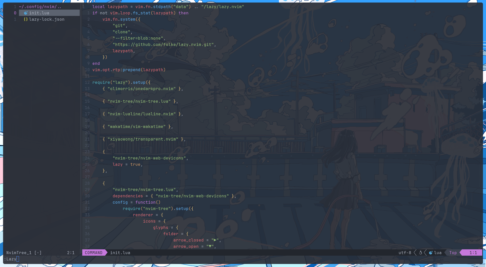

# ramenaru nvim config



## Features

- **File Explorer** (Common universal sidebar)
- **Tab Bar** with buffer management
- **One Dark Pro** theme (with transparency support)
- **WakaTime** integration (time tracking)
- **Git Integration** (status indicators)
- **LSP Support** (autocompletion, diagnostics)
- **Miscellaneous** (color scheme, config shortcut, etc.)

## Installation

### Prerequisites
- Neovim (≥ 0.9)
- Nerd Font (e.g., [Any Nerd Font](https://www.nerdfonts.com/))
- Git

### Quick Start
```bash
# Backup old config (if any)
mv ~/.config/nvim ~/.config/nvim.bak

# Clone this repo
git clone https://github.com/ramenaru/nvim.git ~/.config/nvim
```
